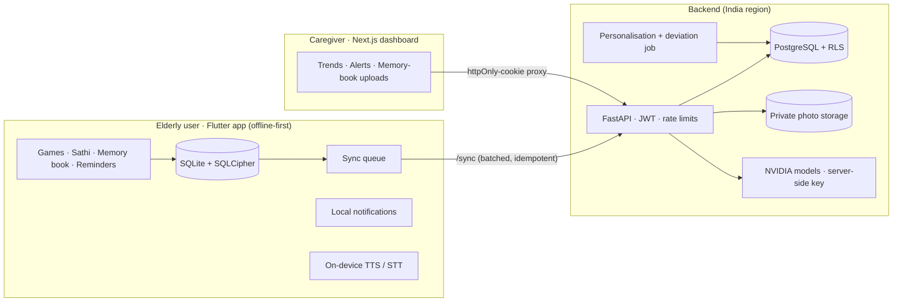

# NEURO-SATHI

Offline-first, multilingual AI companion for elderly cognitive care in North-East India: adaptive memory games, the **Sathi** voice companion, a personal memory book, medicine and routine reminders, and a caregiver dashboard with baseline-deviation alerts.

> NEURO-SATHI is a cognitive-support and monitoring platform. It does **not** diagnose. Clinical validation, usability studies and regulatory assessment are required before any clinical use.



## Repository layout

| Path | What it is |
| --- | --- |
| [`backend/`](backend) | FastAPI API: OTP/JWT auth, roles, `/sync`, memory book, reminders, content, Sathi, speech, dashboard, admin. PostgreSQL schema and RLS in [`backend/db/migrations`](backend/db/migrations). |
| [`dashboard/`](dashboard) | Next.js caregiver and health-worker dashboard. |
| [`mobile/`](mobile) | Flutter app for elderly users (Android first). |
| [`content/language-packs/`](content/language-packs) | One JSON file per language, shared by the backend and the app, with a [guide for translators and reviewers](content/language-packs/README.md). |
| [`docker-compose.yml`](docker-compose.yml) | Local stack: Postgres, Redis, MinIO, API, deviation worker, dashboard. |
| [`.github/workflows/ci.yml`](.github/workflows/ci.yml) | gitleaks, backend on SQLite and on PostgreSQL + RLS, dashboard build + bundle scan, Flutter analyze/test/APK + APK scan. |

## Quick start

### Everything with Docker

```bash
cp .env.example .env   # fill in passwords and JWT_SECRET
docker compose up --build
```

API docs: http://localhost:8000/docs · Dashboard: http://localhost:3000. With `OTP_DEV_ECHO=true` the sign-in code is shown on screen (development only).

### Backend only (no Docker, SQLite)

```bash
cd backend
python -m venv .venv && .venv/bin/pip install -r requirements-dev.txt   # Windows: .venv\Scripts\pip
.venv/bin/python -m app.seed --admin +919800000000
OTP_DEV_ECHO=true .venv/bin/uvicorn app.main:app --reload
.venv/bin/pytest
```

### Dashboard

```bash
cd dashboard
npm install
API_BASE_URL=http://localhost:8000 npm run dev
```

### Mobile app

Needs the Flutter SDK (stable) and Android SDK.

```bash
cd mobile
./tool/bootstrap.sh     # generates android/, patches permissions, pub get, Drift codegen
flutter run --dart-define=API_BASE_URL=http://10.0.2.2:8000
```

## How the pieces fit

- **Offline first.** The app writes every action to its encrypted local database and a sync queue. Games, reminders, the memory book and everyday Sathi questions work with no signal. When online, queued changes are sent to `/sync` in batches. Each batch has a `batch_id` that is kept until the server acknowledges it, so an interrupted batch is retried without being applied twice. Conflicts are resolved by the latest `updated_at`, except that a caregiver's memory-book edit the phone hasn't seen yet wins.
- **Reminders** are scheduled on the phone (weekly, IST) and fire without network. Marking one done, or missing it past a 2-hour grace window, is logged for adherence trends.
- **Sathi** answers today's plan, the next medicine, "who is …" (from the memory book) and the date and time, both on the phone and on the server. Nothing needs to leave the device for these. Other questions go to the backend. There, the NVIDIA Safety Guard checks the question and the reply, and a Sarvam-M call receives only the question text.
- **Languages.** All wording lives in [language packs](content/language-packs): app text, reminder announcements, Sathi's answers and the words it listens for, day names, local time wording and digits, and game word lists. English and Hindi are offered to users. Assamese, Bengali and Nepali are drafted and wait for native-speaker review; until then they appear only in reviewer builds (`--dart-define=SHOW_PREVIEW_LANGUAGES=true`). Packs are bundled with the app so they work offline, and a newer published version is downloaded at sync.
- **Personalisation (v1, explainable).** Per-game features (accuracy, completion, response time, repeated errors) set the difficulty and rank activities with a plain-language reason. The same rules run on the phone for offline play.
- **Deviation detection.** A daily job compares each user's last 7 days with their own previous 28 days. A metric is flagged only when the change is beyond 2 SD of their daily values *and* practically large. Alerts recommend a check-in and are never framed as a diagnosis.

## Security

- **Row-level security.** Every user-owned table has RLS enabled and forced. The API connects as `app_user` (not the owner, no BYPASSRLS) and sets `app.user_id` / `app.user_role` per transaction from the verified JWT. Caregivers read a user's rows only through an active link and write only that user's memory book and reminders. Admins manage content, never personal rows. CI runs the whole API suite on PostgreSQL under these policies, plus direct SQL tests ([`test_rls_pg.py`](backend/tests/test_rls_pg.py)).
- **Rate limits on every route**, keyed by user id (or IP / phone before login), returning 429 with `Retry-After`. Starting values: OTP 3 per phone per 15 min and 10 per IP per hour, Sathi 20/min and 200/day, speech 30/min and 500/day, uploads 20/hour, sync 60/hour, reads 120/min, default 60/min. A test fails if any route lacks a limit. Repeated 429s and failed logins are recorded as security events.
- **Paid-API budget cap.** Once the monthly cap is reached, Sathi falls back to offline answers and cloud speech returns 503, so the phone uses on-device voice.
- **Secrets stay on the server.** The apps never call NVIDIA, SMS or storage providers directly. The dashboard keeps the token in an httpOnly, SameSite=Strict cookie behind a server-side proxy with a CSRF header check. `.env` is git-ignored and only `.env.example` is committed. gitleaks runs in CI, and the built JS bundle and APK are scanned for key patterns.
- **Photos** sit in a private bucket and are served only through short-lived signed URLs after the ownership check. Uploads are sniffed for JPEG/PNG/WebP and capped at 10 MB.
- **On the phone**, SQLCipher encrypts the database with a random 256-bit key held in Keystore-backed secure storage. Sign-out wipes local data. Cloud voice is off until the user consents.
- **Audit log** of who viewed or changed whose data.

## Status

Built so far: everything above. Not yet done:

- Native-speaker review of the Hindi, Assamese, Bengali and Nepali packs (all AI-drafted). Assamese, Bengali and Nepali stay hidden from users until reviewed.
- More NER languages: Manipuri (planned in both Bengali script and Meitei Mayek), Bodo, Khasi, Mizo and others.
- Voice for regional languages. Phones often have no Assamese voice, so the app falls back to a Bengali one; the hosted companion model does not cover Assamese or Nepali, so Sathi gives scripted answers there. See [docs/nvidia-models.md](docs/nvidia-models.md).
- Trained tree-based models (scikit-learn / XGBoost) replacing the v1 rules once there is real data. The same goes for a TFLite model on the phone.
- Background sync via WorkManager while the app is closed. Today it syncs on open, on reconnect and every 15 minutes while open.
- Clinical validation and usability studies with elderly users and caregivers in the NER.
